# <p align = "center">Fejlesztői backend dokumentum</p>


## <p align = "center">Telepitési folyamat:</p>
## Szükséges szoftverek

Az alkalmazás fejlesztéséhez és teszteléséhez szükséged lesz a következő szoftverekre:

- Bármilyen kódot megjelenítő szoftver (ajánlott: [Visual Studio Code](https://code.visualstudio.com/))
- [XAMPP](https://www.apachefriends.org/download.html)
- [PHP](https://www.php.net/downloads.php)
- [Laravel](https://laravel.com/docs/8.x/installation)
- [Insomnia](https://insomnia.rest/download)

Ha még nincsenek telepítve ezek a szoftverek a számítógépeden, az egyes linkekre kattintva letöltheted és telepítheted őket.
<br></br>
# Miután le vannak töltve a szoftverek:


1. lépés
```json
windows-> cmd megnyitás
```
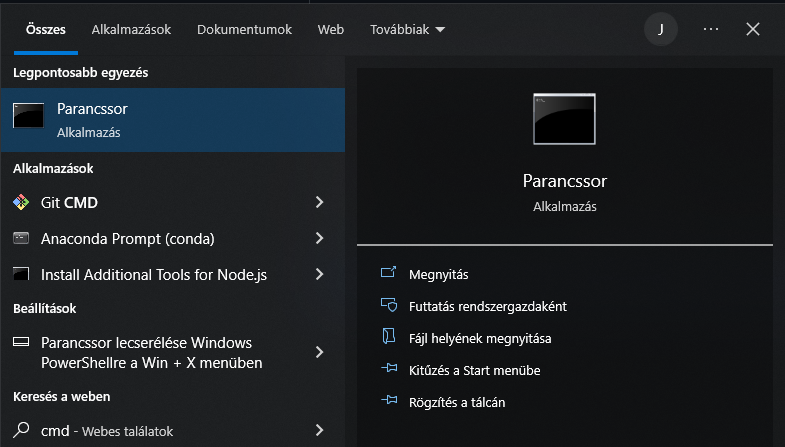
2. lépés
```json
githubról leklónozni a projektet
```
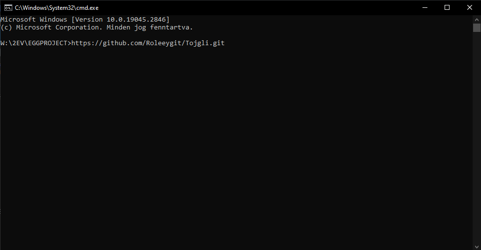
3. lépés
```json
lépjünk be a projekt mappájába ha kész a telepités
```
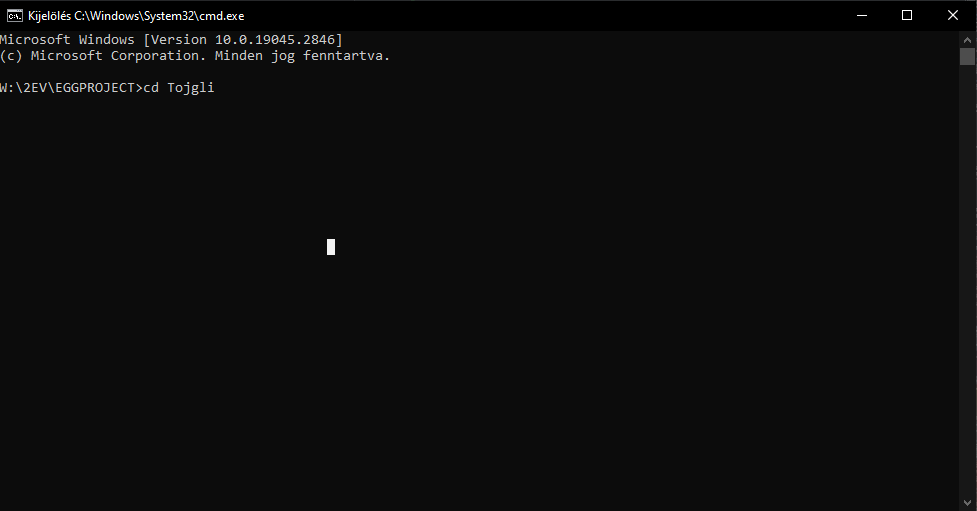
4. lépés
```json
inditsuk el a visual studio codot ezzel a paranccsal:
```
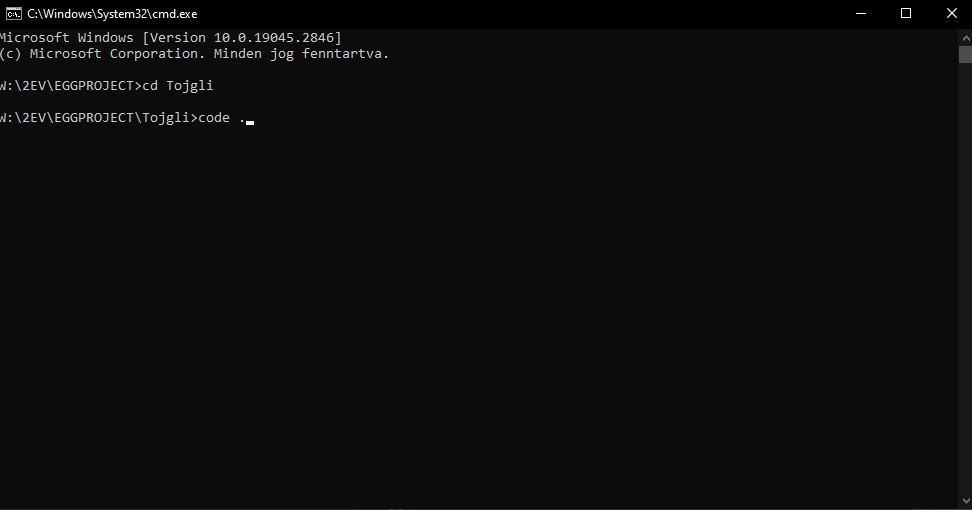
5. lépés
```json
nyissuk meg a terminált
```
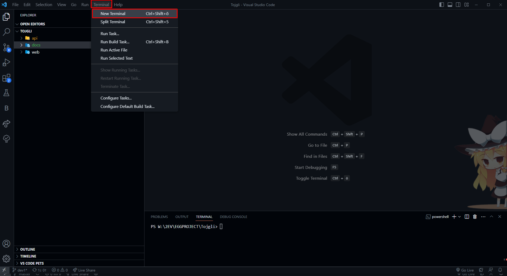
7. lépés
```json
menjünk be az api könyvtárba
```
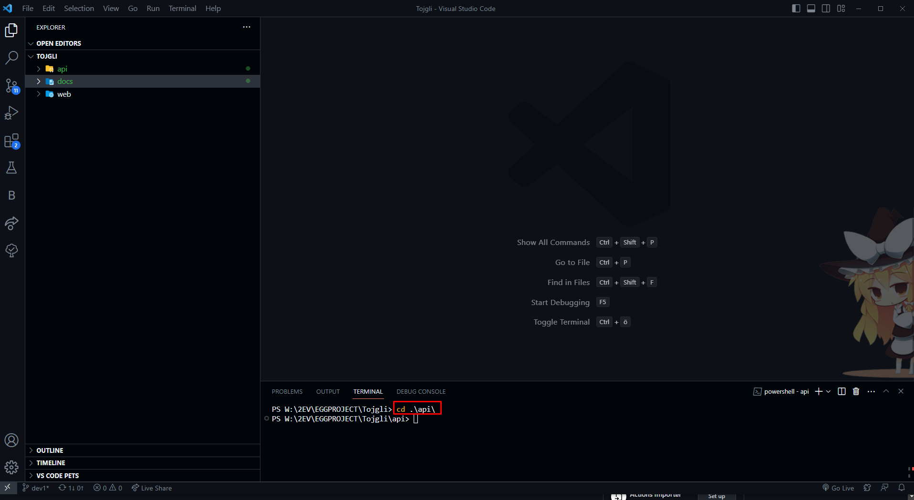
7. lépés
```json
telepitsük a composer függőséget
```
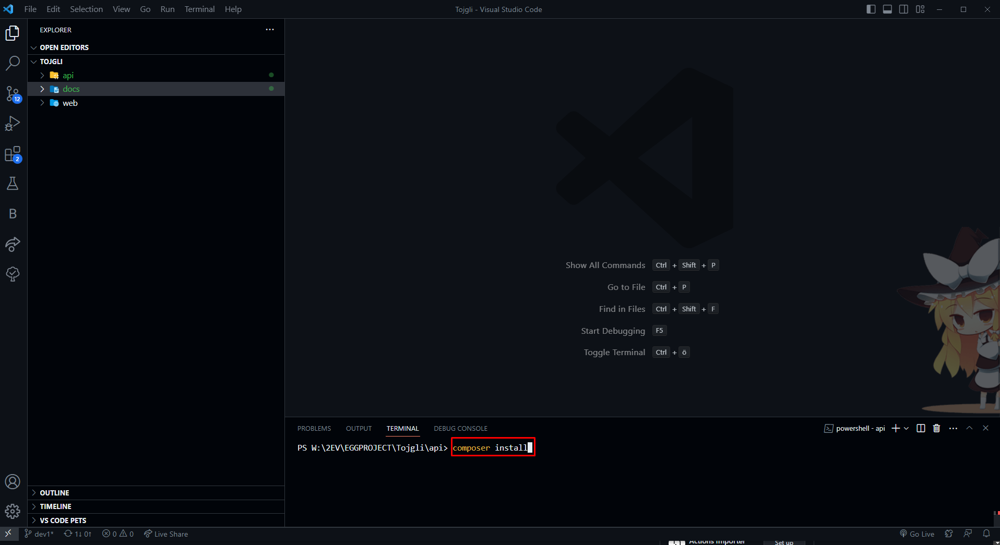
8. lépés
```json
az env.example-ből törölni kell a .example-t, hogy .env maradjon csak
```
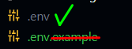   

9. lépés
```json
irjuk be azt az adatbázis nevet ebbe a mezőbe, amit használni szeretnénk
```
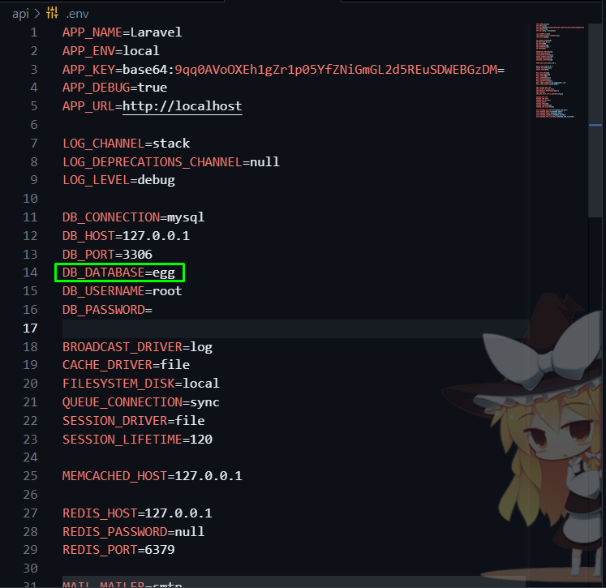

10. lépés
```json
Inditsuk el a xampp applikációt, és azon belül a Apacha szervert, és a  MySQL szervert, amivel csatlakozunk az adatbázishoz
```
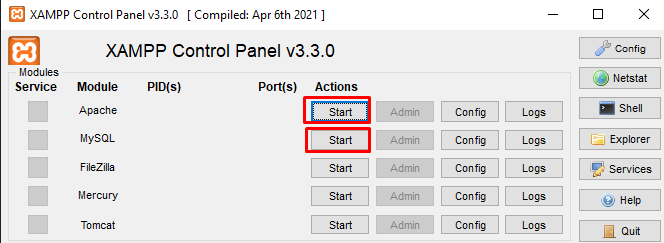

11. lépés
```json
irjuk be a terminálba ezt a parancsot, amivel létrehozunk egy titkositott kulcsot
```
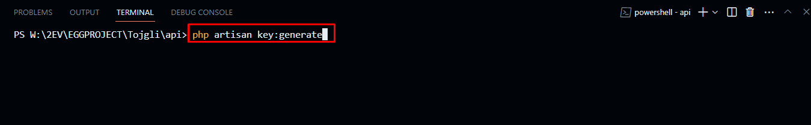

12. lépés
```json
migráljunk (ezzel adjuk hozzá az adatbázis szerkezetet az adatbázis szervernek), ha kérdezi, hogy szeretnéd-e létre hozni az adatbázist, ird be, hogy: yes
```
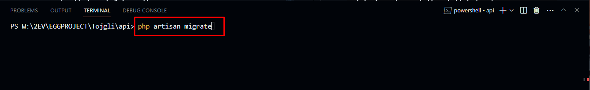

13. lépés
```json
Inditsuk el a php(laravel) szervert
```
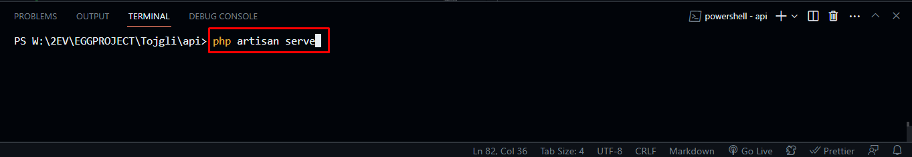

14. lépés
```json
keressük meg az insomnia json fileját ami az: api/insomnia/.. található
```
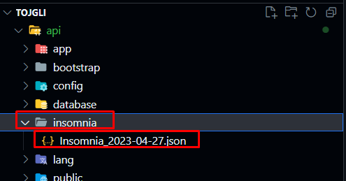

15. lépés
```json
nyissuk meg az insomniát, készitsünk egy új projektet, és egy új kollekciót, majd lépjünk be a kollekcióba
```
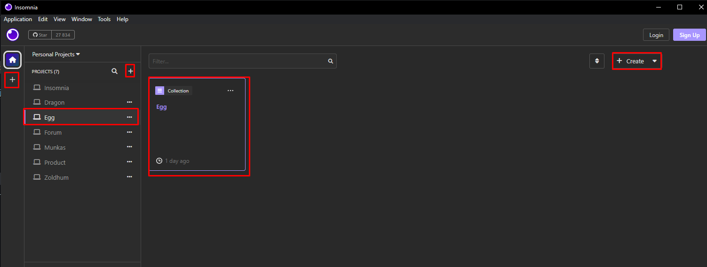

16. lépés
```json
importáljuk a json fájlt ami a projektben található
```
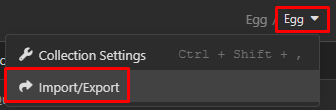
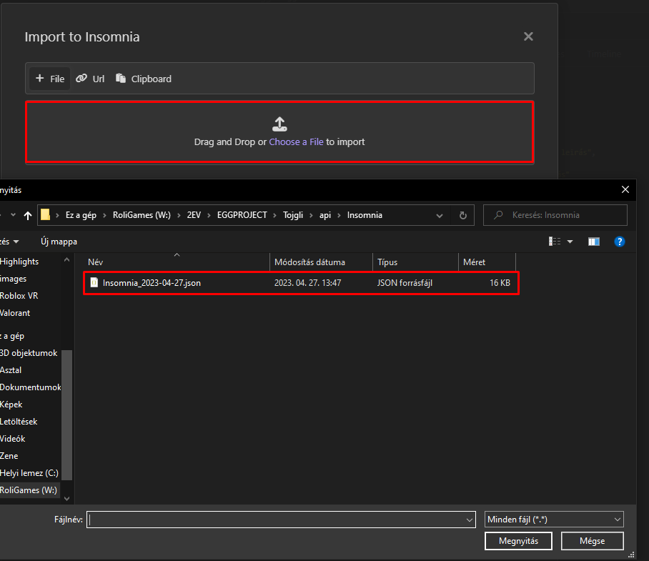

### Ha az importálás megtörtént, akkor már látjuk is az összes metódust, és használhatjuk a backend projektet.

<br></br>


## <p align = "center">Cél:</p>
Egy webshop készitése, ahol különleges tojásokat lehet majd világszerte árusitani. Ezek nagyon egyedi darabok, minden egyes darabból csak 1 készült. 


## <p align = "center">Megvalósitás:</p>

a backend részt Laravel használatával szerettük volna megvalósitani, mert azt találtuk a leghatékonyabbnak.
Adatbázist a MariaDB szerver biztositja.
a frontent rész Angulárban készül el, ez meggyorssitja a töltési folyamat betöltését, és egyszerű a kezelése is.
Ehhez lesz egy asztali alkalmazás java nyelven.

<br></br>

# <p align = "center">Felhasznált technológiák:</p>

### Backend\

- Laravel API (PHP keretrendszer) 
ezen belül:
laravel-sanctum ami az autentikációhoz van felhasználva

- MariaDB szerver (Adatbázis)

<br></br>

### Frontent\
- Lást: a frontent dokumentációban

<br></br>

### Asztali alkalmazás\
- Lást: az asztali alkalmazás dokumentációban

<br></br>

# <p align = "center"> A backend tervhez felhasznált programok:</p>

* Visual Studio Code (kódolás)
* Insomnia (teszt)
* phpmyadmin(adatbázis)
* dia (tervezés)
* github (adattárolás, adatátvitel)

<br></br>

# <p align = "center">Github: fő könyvtárszerkezet:</p>

- api (backend)
- web (frontend)
- docs (tervek, dokumentációk)


api/

	app/

		Console/
		Exceptions/

		Http/
			Controllers/
				BaseController.php
				Controller.php
				ProductController.php
				ProfileController.php
				PurchaseController.php
				UserController.php

			Middleware/

			Resource/
				Category.php
				Product.php
				Profile.php
				User.php
			Kernel.php

		Models/
			Admin.php
			Category.php
			Delivery_mode.php
			Order_date.php
			Payment_mode.php
			Product.php
			Profile.php
			User.php

		Providers/
	bootstrap/
	config/
	database/
		factiories/

		migrations/
			2014_10_12_000000_create_users_table.php
			2014_10_12_100000_create_password_resets_table.php
			2019_12_14_000001_create_personal_access_tokens_table.php
			2023_01_12_090818_create_paymentmodes_table.php
			2023_01_12_090834_create_deliverymodes_table.php
			2023_01_12_090847_create_profiles_table.php
			2023_01_12_090925_create_categories_table.php
			2023_01_12_090939_create_products_table.php

		seeders/
		.gitignore

	insomnia/
		Insomnia_2023-04-27.json

	lang/
	public/
	resource/

	routes/
		api.php
		...

	storage/
		app/
			public/
				images/
					1682594616_giphy.gif
		framework/
		logs/

	tests/
	vendor/
	.editorconfig/
	.env/
	.gitaddrubutes/
	.gitignore/
	artisan/
	composer.json/
	composer.lock/
	package.json/
	phpunit.xml/
	README.md/
	vite.config.js/


	docs/
	Dia
	fejlesztoi_dok/
		backend/
			images/
			tojgli_backend_dev_doc.md
	felhasznaloi_dok/
		backend/
			tojgli_backend_user_doc.md
	Imgs/
	Verions/
		Backend_Versions.md

web/...
	

<br></br>
# <p align = "center">Adatbázis terv:</p>


<br></br>

# <p align = "center">Restapi végpontok:</p>

| HTTP metódus | Végpont                | Leirás                    | Azonositás |
|-------------|-------------------------|--------------------------------|--------------------|
| GET         | /productlist            | Termékek kiirása               | Nem                |
| GET         | /ProductById/{id}       | Termékek kiirása ID alapján    | Nem                |
| POST        | /submit-product         | Új termék hozzáadása           | Igen               |
| PUT         | /updateproduct/{id}     | Termék frissitése              | Igen               |
| POST        | /image/{id}             | Kép hozzáadása a termékhez     | Igen               |
| DELETE      | /deleteproduct/{id}     | Termék törlése                 | Igen               |
| GET         | /profilelist            | Profilok kilistázása           | Nem                |
| PUT         | /updateprofile/{id}     | Profil frissitése              | Igen               |
| POST        | /register               | Új felhasználó regisztrálása   | Igen               |
| POST        | /login                  | Felhasználó bejelentkezés      | Igen               |
| POST        | /logout                 | Felhasználó  kijelentkezése    | Igen               |
| PUT         | /updateadmin/{id}       | Admin jog módositása           | Igen               |
| GET         | /registeredusers        |Regisztrált felhasználók listája| Nem                |
| GET         | /userbyid/{id}          | Felhasználó ID alapján         | Nem                |
| PUT         | /updateuser/{id}        | Felhasználó módositása         | Igen               |
| DELETE      | /deleteuser/{id}        | Felhasználó törlése            | Igen               |
| DELETE      | /deleteprofile/{id}     | Profil törlése                 | Igen               |
| PUT         | /purchase/{id}          | Vásárlás                       | Igen               |

<br></br>

* A profilhoz azért nem kell azonositás, mivel ez alapból üresen jön létre ha egy felhasználó regisztrál, és ezután ő aprofil adatokat módositani tudja magának.

* Felhasználó csak akkor törölhető, ha előtte a profiljának az adatai is törölve lesznek, igy ha a felhasználó törölni szeretné az adatait, akkor az összes elmentett személyes adata is törlésre fog kerülni.

<br></br>

# <p align = "center">Általános működés:</p>

A RESTAPI HTTP kéréseket fogad, ezek tartalmazzák a műveletekhez szükséges adatokat. Az admin részek mint hozzáadás, módositás, törlés (CRUD műveletek) titkositva vannak, igy csak az férhet hozzá akinek van hozzá engedélye. Ezeket a műveleteket fentebb, a végpontoknál jelöltem. Ahol kell azonositás ott a táblában igennek van jelölve. 
A különböző területekre külön kontrollerek lettek készitve átláthatóság szempontjából, és praktikusabb is.
A kontrollerek össze vannak kötve modellekkel, a legtöbb adatot innen tudjuk kiolvasni. De előfordult a erőforrás(resource) használata is a profil és termék esetén, igy egyszerűbbnek találtam később az idegen kulcspárokkal való összekötéseket, illetve lekérdezést, ezért használtam modell helyett.
Az adatokat Json formátumban fogadjuk és dolgozzuk fel. 
Ezek a modellek és erőforrások kapcsolatban állnak az adatbázissal, ahol az összes adatot tároljuk. Az adatokat a modellek kezelik. 

<br></br>

# <p align = "center">Osztályok: (kontrollerek)</p>

## BaseController:
<br></br>

## Feladata:
- Műveletek sikeréről illetve hibáiról választ kapni. Siker esetén azonositó tokent küldd vissza, hiba esetén saját hibaüzenetet.  

## Metódusok: 
### sendResponse(): 
- bejövő paraméterek: $result(generélt token), $message(A felhasználónak szánt saját ünenet, ezt majd a frontend fogadja és ő jeleniti meg)
- kimenő adatok: Response(sikeres bejelentkezés esetén token)
<br></br>

### sendError(): 
- bejövő paraméterek: $error (php hibaüzenete), $errorMessage(saját hibaüzenet), $code(A válaszban küldhető http kód)
- kimenő adatok: Response(sikertelen bejelentkezés esetén hibaüzenet és hibakód)

<br></br>

## UserController:

## Feladatai:
- Új felhasználó regisztrálása, autentikált bejelentkeztetése, kijelentkeztetése

- Összes felhasználó kilistázása

- felhasználó adatainak módositása (Ha szeretne jelszót, felhasználónevet, emailt változtatni)

- admin jogosultság módositása (csak admin tud admint adni, jelen esetben csak a webshop készitőinek van erre jogosultsága)

- felhasználó kilistázása ID alapján

- felhasználó törlése

<br></br>

## Metódusok:

### UserRegister():

- bejövő paraméterek: $request(a regisztrációhoz szükséges adatok a kérésben: name, email, password, confirm_password). 
Az adatokat validálja, majd ha ez sikeres, akkor felveszi az adatokat az adatbázisba a tábla megfelelő mezőibe.
Titkositja a jelszót mielőtt elküldi az adatbázis felé, igy azt mi nem látjuk csak egy titkositott formáját.  
Titkositott jelszó példa: $2y$10$kIstj5qyr8iBvJDrN.Lqe.N8dHyJIYZaMtTxji611tKrrOJdYRDfq.
Ez után a felhasználónak csinál egy üres profilt ezzel a metódussal: $profile = new Profile();

- kimenő adatok: saját üzenetek

- DB::statement("ALTER TABLE users AUTO_INCREMENT = 1;"); 
Ez a metódus pedig arra szolgál, hogyha törlésre kerül egy regisztrált felhasználó, akkor a következő id-t adja, vagyis ha pl  a 3 as ID felhasználó törlésre kerül, akkor a következő regisztráló a 3 as ID-t fogja kapni nem a 4-est, és igy nem lesz kimaradás ID között. Illetve ha köztes ID kerül törlésre, mondjuk van 3 felhasználó és a 2. at töröljük, akkor az eddigi 3as ID-val rendelkező felhasználó 2-es ID-t kap.

### UserLogin():

- bejövő paraméterek: $request (a bejelentkezéshez szükséges adatok a kérésben: username_or_email, password), $credentials ahol megnézzük, hogy az adatbázisban van e már ilyen felhasználónév vagy jelszó, és a kettő közül bármelyikkel be lehet lépni. Sikerek belépés utén generál egy tokent a felhasználó számára, és a personal_access_tokens adatbázis táblába teszi ezt, majd átadja a BaseController sendResponse() metódusának a saját üzenettel együtt. Hiba esetén kiirja, hogy a felhasználónév/email kombinációval van-e baj, vagy a jelszóval.

- kimenő adatok: token, saját üzenet


### UserLogout():

- A metódus a felhasználó kijelentkeztetéséért felelős, miközben törli a felhasználóhóz tartozó tokent az adatbázisból. 

- bejövő paraméterek: $request(a kijelentkezéshez szükséges adatok a kérésben, és a token)

- kimenő adatok: saját üzenet

### ListUsers():

### Adatok:


- Ez a metódus azért felelős, hogykilistázza az összes felhasználó adatait.

- bejövő paraméterek: $users(az összes adatot lekérjük a modellen keresztül)

- kimenő adatok: saját üzenet 

### UpdateUser():

- Ez a metódus a felhaszálók módositásához használatos, ha szeretné későbbiekben módositani az adatait ezzel teheti meg.

- bejövő paraméterek: $request(a módositáshoz szükséges adatok a kérésben: username, email, password), valamint $user["password"] = bcrypt($user["password"]) - vissza titkositja a jelszót ha az változtatásra kerül

- kimenő adatok: saját üzenet

### UpdateAdmin():

- Ez a metódus felelős azért, hogy valakinek admin jogosultságot tudjunk adni. Jelenleg csak admiként lehet admin jogot adni.

- bejövő paraméter: $request(a módositáshoz szükséges adatok a kérésben: is_admin),
User::find(megnézni, hogy létezik e a felhasználó)

-kimenő adatok: saját üzenet

### GetUserById(): 

- Ez a metódus arra szolgál, hogy a felhasználó meg tudja tekinteni saját adatait.

- bejövő paraméter: User::find(megnézi létezik-e ilyen felhasználó)

- kimenő adatok: saját üzenet

### DeleteUser():

- Ez a metódus törli a felhasználónak az adatait. Fontos megjegyezni, hogy előszőr a profilt kell hozzá törlni, különben nem fog működni.
A foreach pedig azért felelős, hogyha törlésre kerül egy felhasználó, akkor ne legyen üres hely, és kapja meg az összes felhasználó az egyel előtti Id-t.

- bejövő paraméterek: User::destroy (ezzel törli), User::find (megkeresi, hogy van-e ilyen felhasználó)

- kimenő adatok: saját üzenet

<br></br>

## ProductController:

## Feladata:
- Weboldal termékeinek kilistázása, adminnal módositása, törlése, termék képének hozzáadása.

## Metódusok: 

### ProductList(): 

- feladata kilistázni az összes terméket a weboldara amit az adatbázisba feltöltünk. Emellett tárolva vannak egy másik táblába a kategóriák, és azt beemeli idegen kulccsal.

- bejövő paraméterek: Product::with("category") - Az összes adatot kiszedi Modellen keresztül a Product és Category táblából. 

- kimenő adatok: saját üzenet

### NewProduct():

- feladata, hogy az admin jogosultsággal rendelkezők tudjanak új terméket felvenni. 

- bejövő paraméterek: $request (az új termékhez szükséges adatok a kérésben: name, price, weight, description, category) a kategóriát pedig ezzel a metódussal kapjuk meg:  $input["category_id"] = Category::where("category", $input["category"])->value("id"), ahol a Category M odellből kiszedjük. 

- kimenő adatok: saját üzenet

### AddImageToProduct():

- feladata, hogy képet tudjunk az adatbázisban tárolni a termékről, fontos tudni, hogy előszőr a terméknek léteznie kell, mielőtt hozzá tudunk adni képet. 

- bejövő paraméterek: $request-> lekéri az összes terméket, majd ebből validátorral figyeli, hogy adtunk e hozzá képet vagy sem. Ez után ha sikeres a kép feltöltés akkor frissiti a termékek táblában az adott terméket.

- kimenő adatok: saját üzenet

### ShowProductById():

- feladata, hogy a weboldalon megjelenő termékekre ha rákattintunk átvisz egy olyan oldalra, ahol kilistázza Id alapján a termékről az információkat egy sheetbe. Igy nagyobban lehet róla látni az adatokat. 

- bejövő paraméterek: $product = Product::find($id) - megkeresi a termék Id-ját, 

- kimenő adatok: saját üzenet

### UpdateProduct():

- feladata, hogy a termékeket ha változnak módositani tudjuk. Például infláció esetán ár emelkedés. (Ezt későbbi verzióban úgy szeretnén megcsinálni, hogy egy új mezőt veszek fel ami nyilván tartja az inflációt és nem az értékét módositom)

- bejövő paraméterek: $request->all(az összes terméket lekéri), majd az if megnézi, hogy van-e ilyen termék, aztán a validátorral ellenőrzi, hogy jól adtuk e hozzá a frissiteni való adatokat. Ebben a verzióban még akkor is meg kell adni a termék nevét ha nem változik semmi, de lehet ugyab az mint az eddigi. 

- kimenő adatok: saját üzenet

### DeleteProduct(): 

- feladata. hogy a terméket törölje. Mivel ezek limitált tojások, ezért ez egy fontos tényező az oldalban. 

- bejövő paraméterek: Product Model, amit destroyold $id alapján. Ez után elmenti a folyamatot

- kimenő adatok: saját üzenet

### ShowCategory(): 

- feladata. hogy a kategóriákat kiirassa, hogy az admin panelbe ha hozzáadunk egy új terméket, akkor ki lehessen egy dropdown menüből választani melyik kategóriát szeretnénk hozzá adni az új termékhez.

- bejövő adatok: Category resource, ami csatlakozik az adatbázishoz, lekéri a category mezőt amiben az adatok vannak. 

- kimenő adatok: saját üzenet

## ProfileController:

## Feladata:
- A felhasználók profiljainak a tárolása, kezelése(módositás, törlés, frissités)

## Metódusok: 

### ListProfiles():

- feladata: kilistázza az összes profilt (Ha valami baj lenne később bármikor hozzá férjünk az összes profilhoz egyszerre)

- bejövő paraméterek: Profile::with(["user", "payment_mode", "delivery_mode"])->get() - A Profile Modellen keresztül lekérjük a profilt, össze kapcsoljuk a userrel, a payment_mode-al és a delivery_moed-al (ez később a fizetésnél lesz fontos, jelenleg üresen tárolja el, ezzel tudjuk bizonyitani, hogy vásárolt-e már az adott profil vagy sem)

- kimenő adatok: saját üzenet


### ShowProfileById():

- feladata: Kilistázza az adott felhasználóhoz tartozó profilt. Ez azért kell,hogy később tudja ezt módositani. 

- bejövő paraméterek: $profile = Profile::with(["user", "payment_mode", "delivery_mode"])->find($id) - Megkeresi a Modellben a profil adatokat, illetve a hozzá tartozó idegen kulcsokat. 

- kimenő adatok: saját üzenet

### UpdateProfile():

- feladata: a felhasználó tudja módositani a saját profilját (ami kezdetben üresen jön létre regisztrációkor) saját adataival. Ez a vásárláshoz lesz majd fontos.

- bejövő paraméterek: $request->all(lekérjük az összes Profil adatot), utána valuidáljuk, megnézzük hogy megadta e az összes adatát: surname, lastname, country, city, address Ha ez sikeres megkeressük a profilt a korrekt Id-vel: Profile::find($id), majd frissitjük a profilt az adatbázisban: $profile->update($request->all())

- kimenő adatok: saját üzenet

### DeleteProfile():

- Feladata: törli a felhasználó profilját

- bejövő paraméterek: Profile::destroy($id) - A Profil Modellben megkeresi az Id-hoz tartozó profilt, és a destroy metódus segitségével törli a profilt.

- kimenő adatok: saját üzenet

## PurchaseController:

## Feladata:
- A felhasználók vásárlásáért felelős ez a kontroller, ha vásárolnak a vásárlási adataikat elmenti a rendszer, ez által ha ismét vesznek bármit megjegyzi az adatokat, és legközelebb már nem kell beirni az adatokat

## Metódusok: 

### Purchase():

- feladata: bekéri a felhasználótól a szállitási módot, és fizetési módot, és ezt eltárolja, illetve ellenőrzi, hogy létezik-e ilyen szállitási vagy fizetási mód.

- bejövő paraméterek: Profile::find($id) - megkeresi a felhasználót, és a hozzá tartozó adatokat, Az if-el ellenőrzi, hogy van-e ilyen Id-val profil, majd A validátor segitségével bekéri a fizetési és szállitási módot, aztán ellenőrzi, hogy ezek a módok validak e, és végül a vásárlás után elmenti a módokat a profilhoz. 

- kimenő adatok: saját üzenet

<br></br>

# Modell kapcsolatok:

### Az adatbázis modelljeinél a kapcsolódások és az idegen kulcsok lehetővé teszik az adatok összekapcsolását és az adatbázis összetettebb műveleteinek végrehajtását. Az alábbi modell kapcsolatokkal és idegen kulcsokkal rendelkezik:

<br></br>

## Delivery_mode modell: 
* A Profile modellal van kapcsolatban, és a 'hasMany' kapcsolattal rendelkezik, mivel egy szállítási módhoz több profil is kapcsolódhat.

## Category modell: 
* A Product modellal van kapcsolatban, és a 'hasMany' kapcsolattal rendelkezik, mivel egy kategóriához több termék is tartozhat.

## Order_date modell: 
* A Profile modellal van kapcsolatban, és a 'hasMany' kapcsolattal rendelkezik, mivel több rendelési dátum is kapcsolódhat egy profilhoz.

## Payment_mode modell:
* A Profile modellal van kapcsolatban, és a 'hasMany' kapcsolattal rendelkezik, mivel több fizetési mód is kapcsolódhat egy profilhoz.

## Product modell: 
* A Category modellal van kapcsolatban, és a 'belongsTo' kapcsolattal rendelkezik, mivel több termék tartozhat egy kategóriához.

## Profile modell: 
* A User, Order_date, Payment_mode és Delivery_mode modellekkel van kapcsolatban, és mindegyik modellhez a 'belongsTo' kapcsolatot használja, mivel minden profil egy felhasználóhoz, egy rendelési dátumhoz, egy fizetési módhoz és egy szállítási módhoz tartozik.

## User modell: 
* A Profile modellal van kapcsolatban, és a 'belongsTo' kapcsolattal rendelkezik, mivel minden felhasználóhoz egy profil tartozik.

<br></br>

## Minden modell az Eloquent ORM használatával lett létrehozva, amely lehetővé teszi az egyszerű és hatékony adatbázisműveleteket az alkalmazásban.

<br></br>

# <p align = "center">Tesztelés:</p>

- A backend oldalról folyamatos tesztelés zajlott a működésben az Insomnia segitségével. Későbbiekben szeretnék RobotFramework-el automata tesztet csinálni az oldalhoz, ahol egy felhasználó teljes MINTA vásárlását lehet majd nyomon követni.


<br></br>

# <p align = "center">Ismert hibák:</p>

- A legtöbb hibát nyomon lehet követni a verzió követő segitségével, ott vannak leirva a módositások, illetve a github követővel is meg lehet nézni a modifikációkat.

<br></br>

# <p align = "center">Fejlesztési lehetőségek:</p>


## Külföldi irány:

- Nagyon sok egyedi tojáspatkoló van világszerte, akiknek a munkájáről nem hallottak még az emberek. Szeretném őket is bevonni, és külön az ő termékeiket is forgalmazni. Facebookon van egy csoport ahol benne vannak a külföldi tojáspatkolók, nekik promótálnám a webshopunkat.